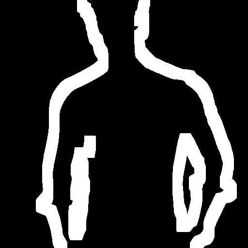
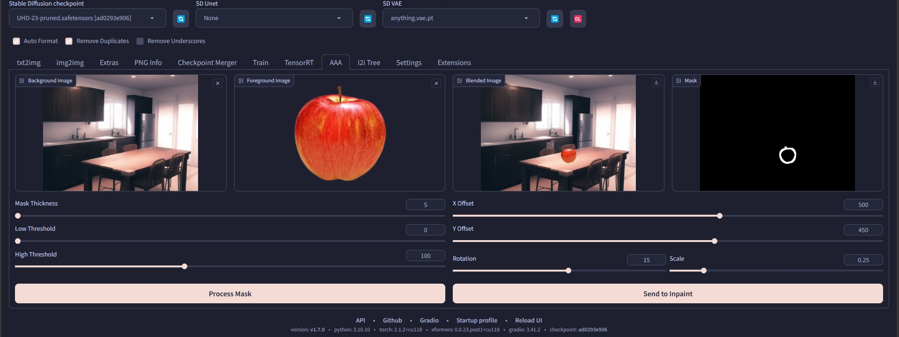

# SD Webui Add Anything Anywhere
This is an Extension for the [Automatic1111 Webui](https://github.com/AUTOMATIC1111/stable-diffusion-webui), 
which automatically generates a mask for Inpainting, from the edges of the specified image.

## But Why?
When you remove the background of a subject and place it on another image, 
the edge of the subject may still contain some blending artifacts or inconsistency.
This can easily be sovlved by doing an Inpaint pass. 
However, manually drawing a mask around the edge can be a chore.
Therefore, use this Extension to automatically generate one for you!

> See also [layerdiffusion](https://github.com/layerdiffusion/sd-forge-layerdiffusion) for cleaner images with no background

## Settings
<ins>**Images**</ins>
- **Background:** Background to place the subject on
- **Foreground:** The subject to place
  - Requires alpha channel *(transparency)*
- **Mask Thickness:** The thickness of the generated mask
  - Adjust this based on the image resolution
- **Low/High Threshold:** Parameters for the Canny edge detection
  - Default values should be fine for the most cases

<ins>**Movements**</ins>
- **X Offset:** Move the subject horizontally
- **Y Offset:** Move the subject vertically
- **Rotation:** Rotate the subject
- **Scale:** Scale the subject

> Spamming this would generate a lot of images in the temporary Gradio directory. 
I recommend you to pre-place the subject instead of using these ~~wacky~~ sliders...

## Example 1

 
<b>1.</b> A photo of a man

 
<b>2.</b> Remove background using <a href="https://github.com/AUTOMATIC1111/stable-diffusion-webui-rembg">rembg</a>

 
<b>3.</b> A photo of a background

 
<b>4.</b> Place subject onto the background 
Notice the grey outline around the subject

 
<b>5.</b> Generate a mask automatically 
<code>(Thickness = 10)</code>

 
<b>6.</b> Inpaint!

## Example 2

 
Place objects <b>anywhere</b>!

